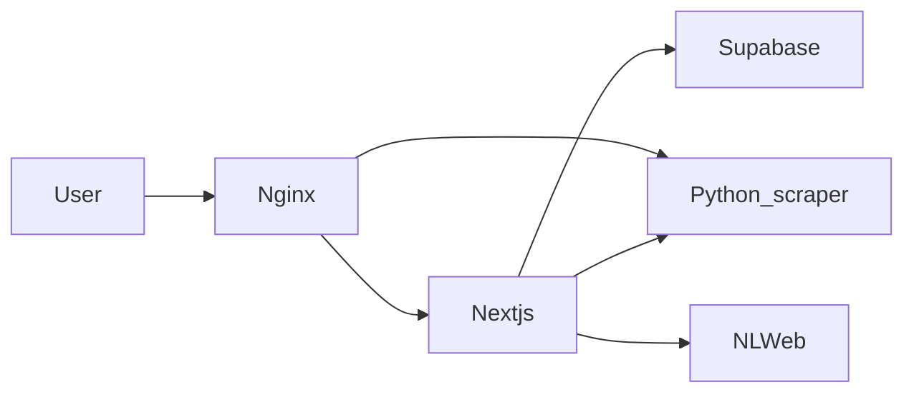

# Zaytoonz NGO — project overview

This document is the single reference for **what this repository is**, how pieces connect, and which environment variables matter for deployment.

## Stack

| Layer | Technology |
|-------|------------|
| Web app | Next.js 14 (App Router), React 18, TypeScript |
| Styling | Tailwind CSS |
| Auth / DB | Supabase (`@supabase/supabase-js`) |
| AI | OpenAI (via app and optional NLWeb) |
| Scraper API | Python FastAPI (`uvicorn api_wrapper:app`) in `python_scraper/` |
| Optional RAG / NL | NLWeb (`NLWeb-main/`, Python) |

## High-level architecture



- **Nginx** (in Docker Compose) terminates HTTP/HTTPS and proxies to the Next.js container and to `/scraper-api/` for the scraper.
- **Next.js** talks to Supabase for auth and data; it can call the scraper over HTTP using `NEXT_PUBLIC_EXTERNAL_SCRAPER_URL` or internal Docker DNS names.
- **python_scraper** is the on-VPS scraping service (Chrome + Playwright in production images).

## App routes (functional map)

| Area | Routes | Purpose |
|------|--------|---------|
| **Home / Social UI** | `/` | `ZaytoonzSMLanding` (main entry). |
| **Legacy Social URL** | `/social` | Redirects to `/`. |
| **Full marketing landing** | `/app` | `LandingPage` (long-form landing). |
| **Auth** | `/auth/signin`, `/auth/signup`, `/auth/callback` | Sign-in and OAuth callback. |
| **Seeker** | `/seeker/*` | Opportunities, tools, profile, Morchid, etc. |
| **NGO** | `/ngo/*` | Dashboard, opportunities, team, resources. |
| **Admin** | `/admin/*` | NGO management, talents, workshops, scraper admin, opportunities. |
| **Public** | `/public/*` | Public NGO/organization views. |
| **Dashboard** | `/dashboard` | Post-auth hub. |

Public routes that skip auth gating on first paint are defined in `app/components/AuthProvider.tsx` (`PUBLIC_ROUTES`).

## Docker services (typical production compose)

| Service | Role |
|---------|------|
| `nextjs` | Built from `Dockerfile.webapp` or run with bind mount (Hostinger variant). |
| `python-scraper` | `working_dir: /app/python_scraper`, volume `./python_scraper`. |
| `nlweb` | Optional NLWeb stack. |
| `nginx` | Reverse proxy; `certbot` sidecar for TLS renewal. |

**Scraper path:** Compose files use **`python_scraper/`** at the repo root (not `Scrape_Master`). Older docs or servers may still reference `Scrape_Master`; align the repo path on the VPS with this layout.

## Environment variables (deployment checklist)

Set these in `.env` on the server (and in CI for image builds where noted).

### Required for core app

| Variable | Build-time | Runtime | Notes |
|----------|------------|---------|--------|
| `NEXT_PUBLIC_SUPABASE_URL` | Yes (Next public) | Yes | Supabase project URL. |
| `NEXT_PUBLIC_SUPABASE_ANON_KEY` | Yes | Yes | Public anon key. |
| `OPENAI_API_KEY` | No | Yes | Server-side OpenAI. |
| `NEXT_PUBLIC_OPENAI_API_KEY` | Yes | Optional | If exposed to client features. |

### Scraper / NLWeb

| Variable | Notes |
|----------|--------|
| `NEXT_PUBLIC_USE_EXTERNAL_SCRAPER` | `true` to use external scraper URL. |
| `NEXT_PUBLIC_EXTERNAL_SCRAPER_URL` | Public URL for browser/server (e.g. `https://yourdomain/scraper-api` behind nginx). |
| `NEXT_PUBLIC_FALLBACK_TO_LOCAL` | Fallback behavior if external scraper fails. |
| `SCRAPER_INTERNAL_URL` | Internal Docker URL (e.g. `http://python-scraper:8000`) where used. |
| `NLWEB_URL` | NLWeb base URL from Next.js (e.g. `http://nlweb:8000`). |

### Optional (NLWeb / other backends)

Compose may pass through: `OPENAI_ENDPOINT`, Azure/OpenAI variants, vector DB URLs, `POSTGRES_*`, etc. See `docker-compose.production.yml` for the full list passed to `nlweb`.

## Repository layout (short)

```
app/                 # Next.js App Router pages and components
python_scraper/      # FastAPI scraper (Docker volume target)
NLWeb-main/          # Optional NLWeb service
public/              # Static assets
Dockerfile.webapp    # Production Next.js image
docker-compose*.yml  # Compose stacks (production, hostinger, beta)
scripts/             # e.g. verify-main-page.sh
```

## Related scripts

- `scripts/verify-main-page.sh` — On the VPS, checks root/social/app routes and container health.

For step-by-step Hostinger VPS deployment, start at [README.md](README.md).
